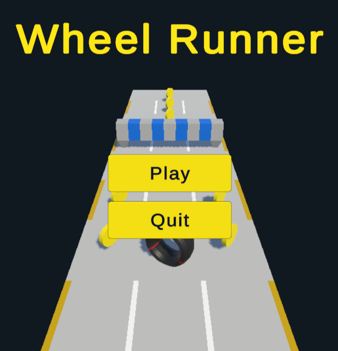
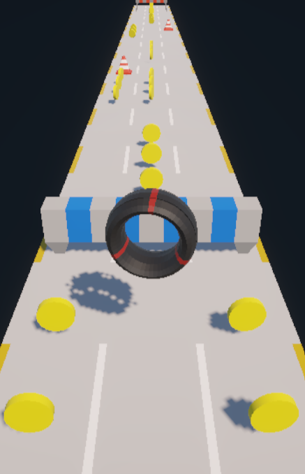

# Wheel Runner: A 3D Endless Runner Game

## Preview

  
  
  

## View Project

### Click here: https://tzolic.itch.io/wheel-runner

## Tools Used

- Game Engine: Unity
- Backend: C#

## Goal(s): Why Did I Build This?

1. Complete an assignment for my game development class

## Target Audience(s): For Who Did I Build This?

1. People who will grade game development assignment

## Key Features

- Engineered an infinite level generation system that dynamically constructs the game path as the player progresses
- Implemented fluid player movement mechanics including running, jumping, and sliding with touchscreen swipe gestures
- Built gameplay systems such as real-time scoring, interactive UI elements (menus, score display), and sound effect management

## How To Install This?

1. Clone this repository
2. Open the `wheel_runner` folder in Unity

## License

### Click here: [MIT](LICENSE)

## Source(s)

https://youtube.com/playlist?list=PL0WgRP7BtOez8O7UAQiW0qAp-XfKZXA9W&si=nAuK5UxWvGlNB1rY

https://github.com/Chaker-Gamra/Endless-Runner-Game