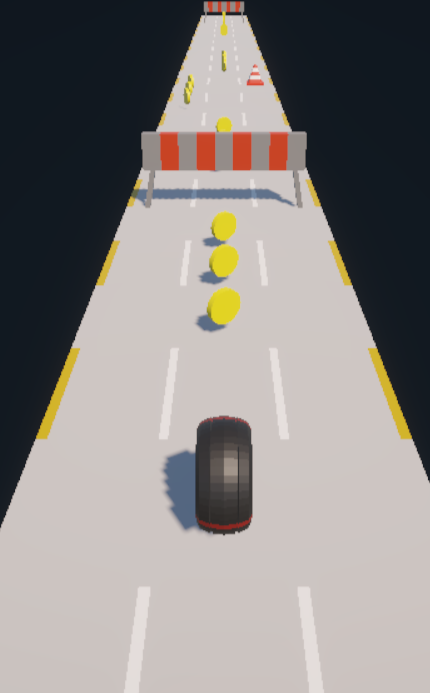

# wheel runner: a 3d endless runner game

## 🌐 view project
### 👉 click here: https://vidrop.itch.io/wheel-runner
## 🎯 why I built it
### ❗ problem
needed to build a cross-platform 3d game from scratch for a game development module
### 🧠 solution
built a simplified 3d endless runner inspired by subway surfers with an infinite level generation system and swipe controls for
cross-platform play
### ⭐ result
achieved an a+ grade and published the game on itch.io, attracting 120+ players
## 🛠️ tools used
unity, c#
## ℹ️ sources
https://youtube.com/playlist?list=PL0WgRP7BtOez8O7UAQiW0qAp-XfKZXA9W&si=nAuK5UxWvGlNB1rY

https://github.com/Chaker-Gamra/Endless-Runner-Game